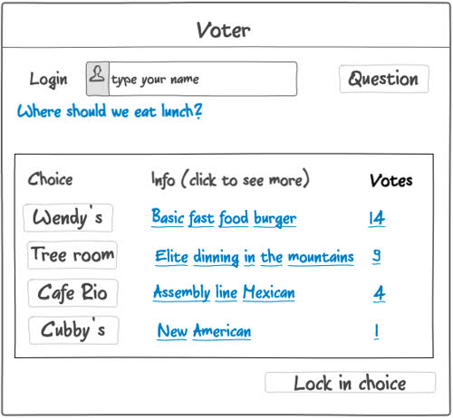

# Voter

## Elevator pitch

Have you ever endlessly debated with your friends about where to meet for lunch, or had your team bog down about an important decision that needs to be made. The Voting application makes it so a group of people can pull out their phones, clearly see the options, and pick their top three choices. As each user makes their choices the results are automatically tallied and displayed in realtime to all the other group members. Once everyone locks in their choices the group can move forward with confidence that the best option has been selected.

### Design

Here is a sequence diagram that shows how to people would interact with the backend to vote.

### Key features

- Secure login over HTTPS
- Ability to select the question to decide
- Display of choices
- Ability to select, and change, top three choices
- Totals from all users displayed in realtime
- Ability for a user to lock in their top three
- Results are persistently stored
- Ability for admin to create and delete questions

### Technologies

- **HTML** - Uses correct HTML structure for application. Two HTML pages. One for login and one for voting. Hyperlinks to choice artifact.
- **CSS** - Application styling that looks good on different screen sizes, uses good whitespace, color choice and contrast.
- **JavaScript** - Provides login, choice display, applying votes, display other users votes, backend endpoint calls.
- **Service** - Backend service with endpoints for:
  - login
  - retrieving choices
  - submitting votes
  - retrieving vote status
- **DB** - Store users, choices, and votes in database.
- **Login** - Register and login users. Credentials securely stored in database. Can't vote unless authenticated.
- **WebSocket** - As each user votes, their votes are broadcast to all other users.
- **React** - Application ported to use the React web framework.
